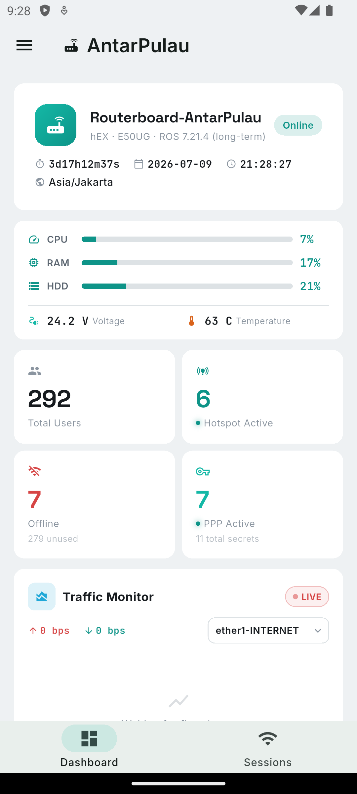
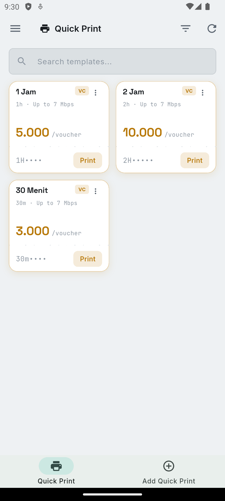
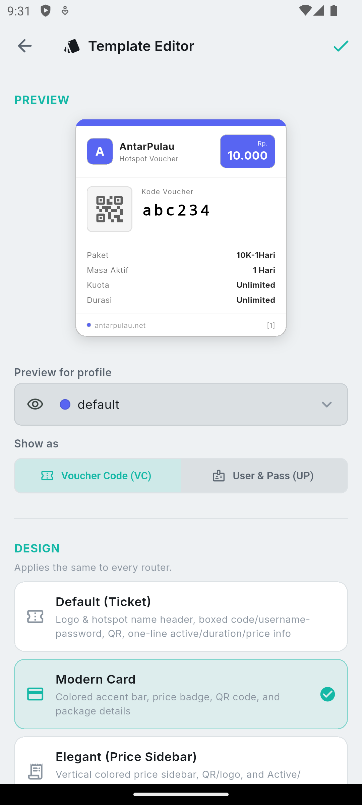
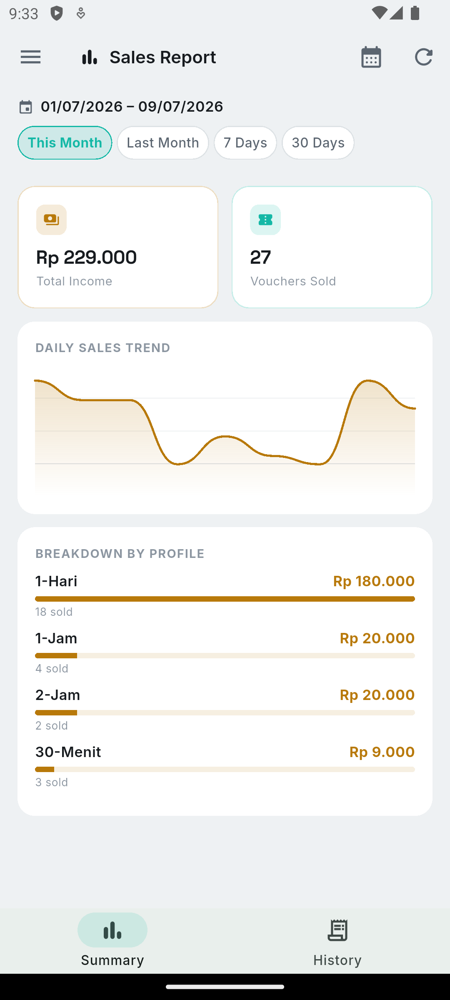

# MikhmonGo

**Manage MikroTik routers (Hotspot & PPP) straight from Android.**

[**⬇ Download latest APK**](https://github.com/Luxi-bit/MikhmonGo-releases/releases/latest)

🇬🇧 English · 🇮🇩 [Bahasa Indonesia](README.id.md)

This repository hosts **APK releases only** — the source code is private
and not published here. See [CHANGELOG.md](CHANGELOG.md) for release notes.

## Screenshots

  
  
  
  

## Features

- **Multi-router** — save multiple router profiles, switch without re-entering credentials.
- **Dashboard** — live stats: resource usage, hotspot/PPP active, uptime, real-time traffic monitor.
- **Hotspot & PPP** — manage users, generate vouchers, active sessions, hosts, profiles, secrets.
- **Voucher printing** — multi-design A4 PDF, or **Quick Print** straight to a Bluetooth thermal printer (ESC/POS) with a scan-to-login QR code.
- **Sales Report** — transaction summary, trend chart, PDF export.
- **Telegram notifications** — router reports/alerts to a Telegram bot.

## Install

1. Download the latest APK from [Releases](../../releases/latest) — pick
   **`-arm64.apk`** (works on virtually every Android phone from 2015
   onward, smaller download). Only use the `-universal.apk` one if the
   arm64 build fails to install on your device.
2. On your Android device, enable "Install from unknown sources" if prompted.
3. Open the downloaded APK to install.

> Since this app isn't distributed through the Play Store, Android's
> Play Protect may warn that it hasn't seen this developer before — this
> is expected for any sideloaded app and not a sign anything is wrong.
> Choose "Install anyway" if prompted.

## Requirements

- Android 8.0 (API 26) or newer.
- A MikroTik router with RouterOS API enabled (to use with the app).

## License

Proprietary — All Rights Reserved. See [LICENSE](LICENSE).
